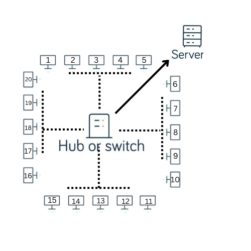

# Project Title: Comprehensive LAN Network Setup for Computer Lab

**Project Description:** The project involved designing, installing, and configuring a Local Area Network (LAN) for a computer lab equipped with 20 computers and a network printer. The network was structured using a star topology, where each computer is connected to a central hub, facilitating streamlined data communication. A hub served as the central device for internal communication, while a router managed internet access and routed data between the local network and external networks.

For seamless printer integration, we configured a printer gateway, allowing all devices on the network to share the printer without conflicts or performance issues. The network was designed to ensure secure and reliable communication using the TCP/IP protocol, which facilitated efficient data transfer and addressed protocol requirements for local network and internet access.

 

During this project, I had the responsibility of leading a team of network engineers and technicians, overseeing tasks from initial planning to execution. This leadership role involved assigning tasks, troubleshooting installation challenges, and coordinating efforts to ensure the project was completed within the designated timeframe.

# Key Steps and Features of the Project:

## Network Design:

- Implemented a star topology, where each computer is individually connected to the hub, ensuring minimal failure points in the event of a connection issue.
- Utilized a hub as the central communication device, supporting efficient data exchange between all connected computers.
- Installed a router to manage internet connectivity and data routing between the internal network and external resources.
**Printer Gateway Setup:**

- Configured a dedicated gateway for the network printer, enabling all computers to access the printer seamlessly.
- Ensured smooth data transmission from multiple devices to the printer without network traffic bottlenecks.
**Protocol Configuration:**

- Utilized the TCP/IP protocol for managing network communications, ensuring compatibility with internet protocols and local network efficiency.
- Assigned IP addresses to all devices using DHCP, allowing dynamic and flexible IP management across the network.
**Security Measures:**

- Configured firewalls on the router to prevent unauthorized access and ensure network security.
- Implemented basic encryption to safeguard data transmitted between devices within the network.
**Testing and Troubleshooting:**

- Performed thorough testing to identify any network inconsistencies, addressing challenges related to connectivity, printer access, and network performance.
- Ensured that all devices could access both the local network resources (such as the printer) and external internet resources seamlessly.
**Key Technologies and Tools Used:**

- Star topology (network design)
- Hub (central communication device)
- Router (for internet routing and external network access)
- TCP/IP protocol (for managing communication between devices)
- DHCP (for dynamic IP address allocation)
- Printer gateway (for shared printing functionality)
- Network security measures (firewalls and basic encryption)
# Conclusion:

The successful completion of the LAN network setup for the computer lab equipped with 20 computers and a printer demonstrated our team's ability to plan, design, and implement a robust and efficient network infrastructure. By utilizing a star topology with a hub as the central communication device and a router for internet access, we ensured smooth data flow and reliable connectivity. The inclusion of a printer gateway further optimized resource sharing within the network.

Leading this project not only enhanced my technical proficiency in networking and TCP/IP protocol management but also strengthened my leadership skills, as I successfully guided a team through the entire process. The project has provided me with valuable hands-on experience in network design, problem-solving, and team coordination, preparing me for more advanced networking tasks in future endeavors.
